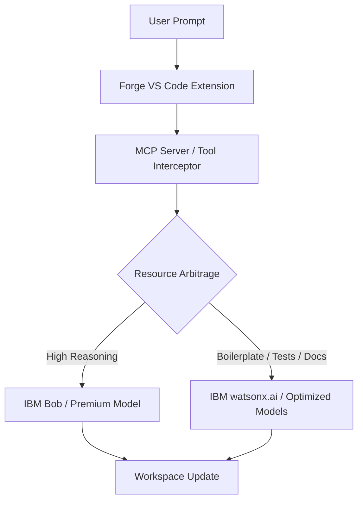

# ⬡ Forge: The Universal Sidecar for AI Orchestration

**Less context. Less cost. More focus.**

Forge is a **VS Code Extension** and **Model Context Protocol (MCP)** server that sits between IBM Bob and his workload — intercepting tasks, routing them intelligently, and keeping Bob's context lean.

---

## 🚀 Why Forge?

IBM Bob is powerful, but power is expensive. Every routine task—boilerplate, unit tests, documentation—inflates the context window and burns **Bobcoin**. Forge stops that waste through **Resource Arbitrage**.

### Key Pillars:
- **Resource Arbitrage:** Automatically routes "low-reasoning" tasks to specialized models on **IBM watsonx.ai**, reserving Bob for high-level architectural decisions.
- **Context Management:** Keeps the workspace lean by distilling context, preventing the "Context Tax" that leads to hallucinations and inefficiency.
- **Bobcoin Efficiency:** Live "Fuel Gauge" tracks your budget, delivering up to **5x output per Bobcoin**.

---

## 🛠 Architecture

Forge operates as a sidecar via the Model Context Protocol (MCP), allowing Bob to delegate tasks without losing oversight.



---

## 📦 Features

- **Forge Control Sidebar:** A dedicated VS Code view to monitor active tasks, agent status, and budget.
- **Bobcoin Fuel Gauge:** Real-time visual tracking of AI compute spending.
- **MCP Tool Suite:** Provides Bob with specialized tools for scaffolding, security analysis, and code construction that run on optimized infrastructure.
- **Template Library:** Instant scaffolding for React, Python, and more via `forge.scaffold`.

---

## ⚙️ Setup

### Prerequisites
- VS Code 1.85+
- Node.js 20+
- IBM watsonx.ai API Key & Project ID

### Installation
1. Clone the repository.
2. Install dependencies:
   ```bash
   npm install
   ```
3. Build the extension and renderer:
   ```bash
   npm run compile
   ```
4. Press `F5` in VS Code to launch the **Extension Development Host**.

### Configuration
Set your credentials in VS Code Settings (`Ctrl+,`) or via the Forge Sidebar:
- `forge.watsonx.apiKey`
- `forge.watsonx.projectId`
- `forge.budget.maxBobcoins`

---

## 📂 Project Structure

```
forge/
├── src/
│   ├── extension.ts      # Extension entry point & VS Code commands
│   ├── mcp/              # MCP Server implementation
│   ├── services/         # Watsonx & Resource Arbitrage logic
│   └── webview/          # Sidebar UI controllers
├── renderer/             # React-based Sidebar UI
├── templates/            # Project scaffolding seeds
└── package.json          # Extension manifest
```

---

## 🔗 Integrated with IBM watsonx.ai

Forge leverages the full power of the **IBM watsonx.ai** ecosystem to provide model routing and task delegation that traditional AI agents cannot match. By treating "context" as a finite resource, Forge ensures your development stays fast, focused, and under budget.
