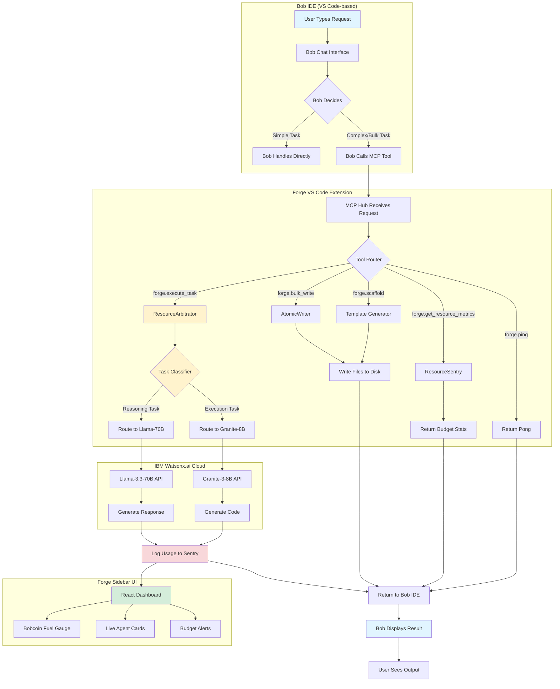

# 🔄 Forge System Flow: Complete Integration Guide

This document explains how **Bob IDE**, **Forge MCP Server**, and **Watsonx.ai** work together to achieve intelligent resource arbitrage.

---

## 📊 High-Level Flow Diagram



---

## 🔍 Detailed Flow Breakdown

### Phase 1: User Interaction with Bob IDE

```
┌─────────────────────────────────────────────────────────────┐
│  User in Bob IDE                                             │
│  ┌────────────────────────────────────────────────────┐    │
│  │ User: "Create a React todo app with TypeScript"    │    │
│  └────────────────────────────────────────────────────┘    │
│                          ↓                                   │
│  ┌────────────────────────────────────────────────────┐    │
│  │ Bob (Llama-70B) analyzes the request               │    │
│  │ - Determines this needs bulk scaffolding           │    │
│  │ - Decides to delegate to Forge MCP server          │    │
│  └────────────────────────────────────────────────────┘    │
└─────────────────────────────────────────────────────────────┘
```

**Key Point:** Bob IDE has Forge configured as an MCP server in its settings. When Bob determines a task can be optimized through Forge, it calls the appropriate MCP tool.

---

### Phase 2: MCP Server Connection

```
┌─────────────────────────────────────────────────────────────┐
│  Bob IDE MCP Client                                          │
│  ┌────────────────────────────────────────────────────┐    │
│  │ HTTP POST to http://localhost:3000/sse              │    │
│  │ Establishes SSE (Server-Sent Events) connection    │    │
│  └────────────────────────────────────────────────────┘    │
│                          ↓                                   │
│  ┌────────────────────────────────────────────────────┐    │
│  │ Sends MCP Tool Call:                                │    │
│  │ {                                                   │    │
│  │   "method": "tools/call",                           │    │
│  │   "params": {                                       │    │
│  │     "name": "forge.scaffold",                       │    │
│  │     "arguments": {                                  │    │
│  │       "type": "web",                                │    │
│  │       "name": "todo-app"                            │    │
│  │     }                                               │    │
│  │   }                                                 │    │
│  │ }                                                   │    │
│  └────────────────────────────────────────────────────┘    │
└─────────────────────────────────────────────────────────────┘
                          ↓
┌─────────────────────────────────────────────────────────────┐
│  Forge MCP Hub (Express Server on :3000)                    │
│  ┌────────────────────────────────────────────────────┐    │
│  │ MCPHub.ts receives the tool call                    │    │
│  │ - Validates request                                 │    │
│  │ - Checks budget with ResourceSentry                 │    │
│  │ - Routes to appropriate handler                     │    │
│  └────────────────────────────────────────────────────┘    │
└─────────────────────────────────────────────────────────────┘
```

**Configuration Required:**
Bob IDE needs this in its MCP settings (typically in `.bob/mcp.json` or VS Code settings):

```json
{
  "mcpServers": {
    "forge": {
      "url": "http://localhost:3000/sse",
      "transport": "sse"
    }
  }
}
```

---

### Phase 3: Resource Arbitrage Decision

```
┌─────────────────────────────────────────────────────────────┐
│  ResourceArbitrator.ts                                       │
│  ┌────────────────────────────────────────────────────┐    │
│  │ Task: "Implement user authentication with JWT"     │    │
│  └────────────────────────────────────────────────────┘    │
│                          ↓                                   │
│  ┌────────────────────────────────────────────────────┐    │
│  │ Keyword Analysis:                                   │    │
│  │ ✓ Contains "implement" → Execution keyword         │    │
│  │ ✗ No "plan", "architecture" → Not reasoning        │    │
│  │                                                     │    │
│  │ DECISION: Route to Granite-3-8B (cheap)            │    │
│  └────────────────────────────────────────────────────┘    │
│                          ↓                                   │
│  ┌────────────────────────────────────────────────────┐    │
│  │ Budget Check (ResourceSentry):                      │    │
│  │ - Estimate: ~2000 tokens                           │    │
│  │ - Cost: 0.2 Bobcoins (Granite rate)                │    │
│  │ - Current: 5.3 BC used / 40 BC budget              │    │
│  │ - Status: ✓ APPROVED                               │    │
│  └────────────────────────────────────────────────────┘    │
└─────────────────────────────────────────────────────────────┘
```

**Routing Logic:**

| Task Type | Keywords | Model | Cost/1k tokens |
|-----------|----------|-------|----------------|
| **Reasoning** | plan, architecture, design, review, compare, refactor strategy | Llama-3.3-70B | 1.0 BC |
| **Execution** | implement, write code, fix bug, add test, document, boilerplate | Granite-3-8B | 0.1 BC |

---

### Phase 4: Watsonx.ai API Call

```
┌─────────────────────────────────────────────────────────────┐
│  WatsonxClient.ts                                            │
│  ┌────────────────────────────────────────────────────┐    │
│  │ 1. Get OAuth Token (cached for 1 hour)             │    │
│  │    POST https://iam.cloud.ibm.com/identity/token   │    │
│  │    Body: apikey=YOUR_WATSON_API_KEY                │    │
│  └────────────────────────────────────────────────────┘    │
│                          ↓                                   │
│  ┌────────────────────────────────────────────────────┐    │
│  │ 2. Call Watsonx.ai Generation API                  │    │
│  │    POST https://us-south.ml.cloud.ibm.com/         │    │
│  │         ml/v1/text/generation?version=2023-05-29   │    │
│  │                                                     │    │
│  │    Headers:                                         │    │
│  │      Authorization: Bearer <token>                 │    │
│  │      Content-Type: application/json                │    │
│  │                                                     │    │
│  │    Body:                                            │    │
│  │    {                                                │    │
│  │      "model_id": "ibm/granite-3-8b-instruct",      │    │
│  │      "input": "Implement user auth with JWT...",   │    │
│  │      "project_id": "YOUR_PROJECT_ID",              │    │
│  │      "parameters": {                                │    │
│  │        "max_new_tokens": 1000,                     │    │
│  │        "return_options": {                          │    │
│  │          "input_token_count": true,                │    │
│  │          "generated_token_count": true             │    │
│  │        }                                            │    │
│  │      }                                              │    │
│  │    }                                                │    │
│  └────────────────────────────────────────────────────┘    │
└─────────────────────────────────────────────────────────────┘
                          ↓
┌─────────────────────────────────────────────────────────────┐
│  IBM Watsonx.ai Cloud Response                               │
│  ┌────────────────────────────────────────────────────┐    │
│  │ {                                                   │    │
│  │   "results": [{                                     │    │
│  │     "generated_text": "// JWT Auth Implementation  │    │
│  │                        const jwt = require('...')   │    │
│  │                        ...",                        │    │
│  │     "input_token_count": 450,                      │    │
│  │     "generated_token_count": 1850                  │    │
│  │   }]                                                │    │
│  │ }                                                   │    │
│  └────────────────────────────────────────────────────┘    │
└─────────────────────────────────────────────────────────────┘
```

---

### Phase 5: Cost Tracking & UI Update

```
┌─────────────────────────────────────────────────────────────┐
│  ResourceSentry.ts                                           │
│  ┌────────────────────────────────────────────────────┐    │
│  │ logUsage(450, 1850, "ibm/granite-3-8b-instruct")   │    │
│  │                                                     │    │
│  │ Calculations:                                       │    │
│  │ - Total tokens: 2300                               │    │
│  │ - Actual cost: 2.3k × 0.1 BC = 0.23 BC            │    │
│  │ - Baseline (if Llama): 2.3k × 1.0 BC = 2.3 BC     │    │
│  │ - SAVED: 2.07 BC (90% savings!)                    │    │
│  │                                                     │    │
│  │ Updated Totals:                                     │    │
│  │ - Used: 5.53 BC / 40 BC (13.8%)                    │    │
│  │ - Saved: 12.45 BC                                  │    │
│  │ - Remaining: 34.47 BC                              │    │
│  └────────────────────────────────────────────────────┘    │
│                          ↓                                   │
│  ┌────────────────────────────────────────────────────┐    │
│  │ Fire onUpdate event → ForgeSidebarProvider         │    │
│  └────────────────────────────────────────────────────┘    │
└─────────────────────────────────────────────────────────────┘
                          ↓
┌─────────────────────────────────────────────────────────────┐
│  Forge Sidebar UI (React)                                    │
│  ┌────────────────────────────────────────────────────┐    │
│  │  ⬡ Forge Control Panel                             │    │
│  │  ┌──────────────────────────────────────────┐     │    │
│  │  │ 💰 Bobcoin Fuel Gauge                     │     │    │
│  │  │ ████████░░░░░░░░░░░░░░░░░░░░░░░░ 13.8%   │     │    │
│  │  │ Used: 5.53 BC | Saved: 12.45 BC          │     │    │
│  │  └──────────────────────────────────────────┘     │    │
│  │                                                     │    │
│  │  📊 Active Tasks                                   │    │
│  │  ┌──────────────────────────────────────────┐     │    │
│  │  │ ✓ Granite-8B Worker                       │     │    │
│  │  │   Task: Implement JWT auth                │     │    │
│  │  │   Status: Complete (2.3k tokens)          │     │    │
│  │  │   Cost: 0.23 BC (saved 2.07 BC)           │     │    │
│  │  └──────────────────────────────────────────┘     │    │
│  └────────────────────────────────────────────────────┘    │
└─────────────────────────────────────────────────────────────┘
```

---

### Phase 6: Return to Bob IDE

```
┌─────────────────────────────────────────────────────────────┐
│  MCP Response Flow                                           │
│  ┌────────────────────────────────────────────────────┐    │
│  │ Forge MCP Hub sends response:                       │    │
│  │ {                                                   │    │
│  │   "content": [{                                     │    │
│  │     "type": "text",                                 │    │
│  │     "text": "// JWT Auth Implementation\n..."      │    │
│  │   }]                                                │    │
│  │ }                                                   │    │
│  └────────────────────────────────────────────────────┘    │
│                          ↓                                   │
│  ┌────────────────────────────────────────────────────┐    │
│  │ Bob IDE receives response via SSE                   │    │
│  └────────────────────────────────────────────────────┘    │
│                          ↓                                   │
│  ┌────────────────────────────────────────────────────┐    │
│  │ Bob displays result to user:                        │    │
│  │                                                     │    │
│  │ "I've implemented JWT authentication using Forge.  │    │
│  │  The code has been generated and is ready for      │    │
│  │  review. This task used 0.23 Bobcoins instead of   │    │
│  │  2.3 Bobcoins - saving you 90%!"                   │    │
│  └────────────────────────────────────────────────────┘    │
└─────────────────────────────────────────────────────────────┘
```

---

## 🎯 The "Lessening Bob Stuff" Explained

### What "Bob Stuff" Means

**"Bob stuff"** refers to the expensive operations that consume Bobcoins:
- Every message to Bob uses Llama-3.3-70B (expensive model)
- Complex reasoning tasks
- Long conversations
- Multiple iterations

### How Watsonx.ai "Lessens" It

Forge intercepts tasks that don't need Bob's full reasoning power:

| Without Forge | With Forge | Savings |
|---------------|------------|---------|
| Bob (Llama-70B) writes boilerplate | Forge (Granite-8B) writes boilerplate | 90% |
| Bob generates tests | Forge generates tests | 90% |
| Bob scaffolds projects | Forge scaffolds projects | 90% |
| Bob writes documentation | Forge writes documentation | 90% |

**Example Scenario:**

```
Task: "Create a full-stack todo app with React, Node.js, and PostgreSQL"

WITHOUT FORGE:
- Bob plans: 2k tokens × 1.0 BC = 2.0 BC
- Bob writes frontend: 8k tokens × 1.0 BC = 8.0 BC
- Bob writes backend: 10k tokens × 1.0 BC = 10.0 BC
- Bob writes tests: 5k tokens × 1.0 BC = 5.0 BC
TOTAL: 25.0 BC

WITH FORGE:
- Bob plans: 2k tokens × 1.0 BC = 2.0 BC
- Forge writes frontend: 8k tokens × 0.1 BC = 0.8 BC
- Forge writes backend: 10k tokens × 0.1 BC = 1.0 BC
- Forge writes tests: 5k tokens × 0.1 BC = 0.5 BC
TOTAL: 4.3 BC

SAVINGS: 20.7 BC (83% reduction!)
```

---

## 🔧 Setup Requirements

### 1. Watsonx.ai Credentials

Create `watson/.env`:
```bash
WATSON_API_KEY=your_ibm_cloud_api_key
WATSON_PROJECT_ID=your_watsonx_project_id
WATSON_URL=https://us-south.ml.cloud.ibm.com
```

### 2. Bob IDE MCP Configuration

Add to Bob's MCP settings (`.bob/mcp.json` or VS Code settings):
```json
{
  "mcpServers": {
    "forge": {
      "url": "http://localhost:3000/sse",
      "transport": "sse",
      "description": "Forge AI Orchestration Sidecar"
    }
  }
}
```

### 3. Start Forge Extension

1. Open this project in VS Code
2. Press F5 to launch Extension Development Host
3. Forge MCP server starts on port 3000
4. Forge sidebar appears in activity bar

### 4. Connect Bob IDE

1. Open Bob IDE
2. Verify Forge MCP server is listed in settings
3. Test connection: Ask Bob to "Use Forge to ping"
4. Bob should call `forge.ping` and get "Pong!" response

---

## 🎬 Demo Flow for Hackathon

```
1. Show Bob IDE with 40 Bobcoins budget
   ↓
2. Ask Bob: "Create a React todo app"
   ↓
3. Bob analyzes and decides to use Forge
   ↓
4. Forge sidebar shows:
   - Task routed to Granite-8B
   - Real-time token usage
   - Cost savings calculation
   ↓
5. Files are generated
   ↓
6. Final stats:
   - Used: 4.3 BC (instead of 25 BC)
   - Saved: 20.7 BC (83%)
   - Remaining: 35.7 BC for more features!
```

---

## 🚨 Current Gaps

1. **Bob MCP Integration:** Need to verify Bob can actually connect to the SSE endpoint
2. **Credentials:** Need valid Watsonx.ai API key and project ID
3. **Testing:** Need to test the full flow end-to-end
4. **Documentation:** Need to document how Bob discovers and uses Forge tools
