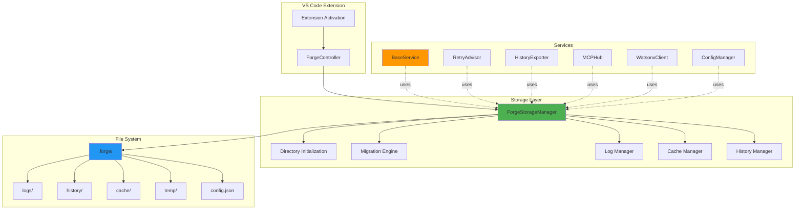
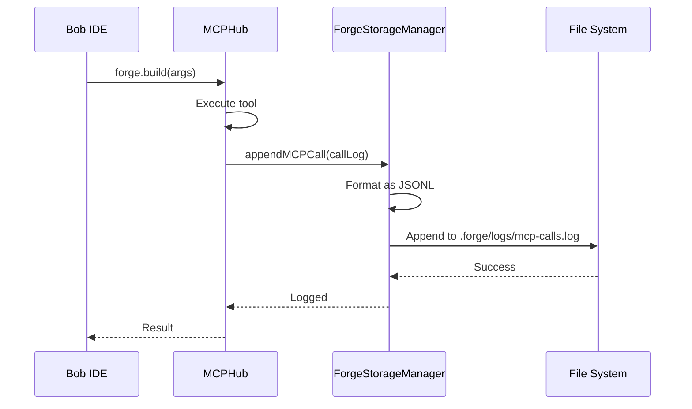
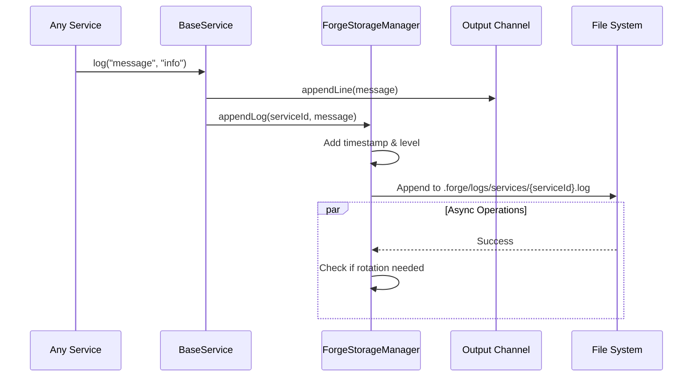
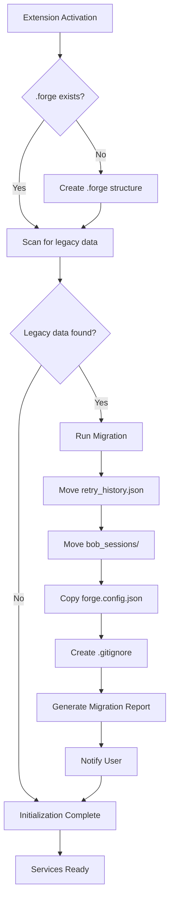
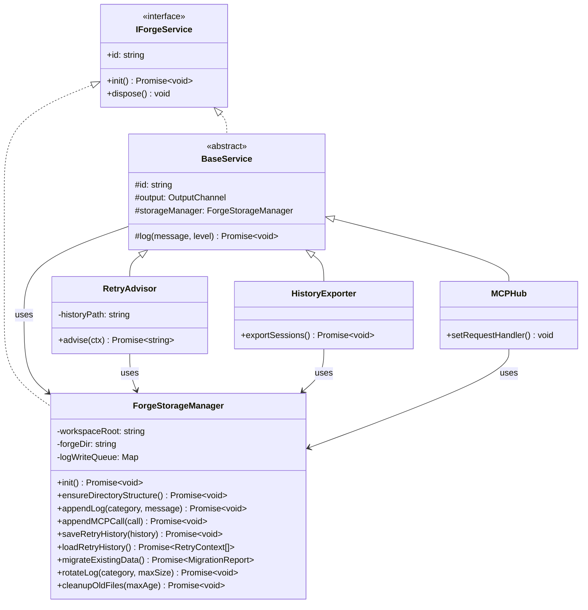
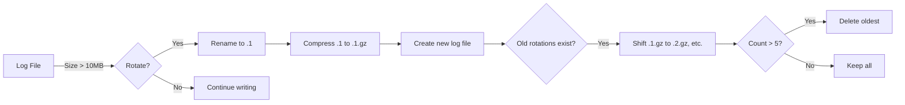

# Forge Storage Architecture

## System Architecture Diagram



## Data Flow: MCP Call Logging



## Data Flow: Service Logging



## Migration Flow



## Storage Manager Class Hierarchy



## File Organization Strategy

### Directory Structure Rationale

```
.forge/
├── config.json              # User-editable configuration
├── logs/                    # All logging output
│   ├── forge.log           # Main extension log (all services)
│   ├── mcp-calls.log       # MCP tool invocations (JSONL)
│   ├── watsonx.log         # Watsonx API calls (JSONL)
│   └── services/           # Per-service detailed logs
│       ├── atomic-writer.log
│       ├── resource-sentry.log
│       └── ...
├── history/                 # Historical records
│   ├── retry_history.json  # Error patterns & fixes
│   ├── sessions/           # Bob session exports
│   └── builds/             # Build history records
├── cache/                   # Temporary cached data
│   ├── codebase-analysis.json
│   ├── dependency-cache.json
│   └── system-context.json
└── temp/                    # Ephemeral files (auto-cleaned)
```

### Why This Structure?

1. **`logs/`**: Centralized logging for debugging and auditing
   - `forge.log`: Quick overview of all activity
   - `mcp-calls.log`: Detailed MCP tool usage for Bob IDE integration
   - `watsonx.log`: API call tracking for cost analysis
   - `services/`: Granular per-service logs for deep debugging

2. **`history/`**: Persistent records for learning and recovery
   - `retry_history.json`: Helps RetryAdvisor learn from past errors
   - `sessions/`: Preserves Bob IDE session data
   - `builds/`: Tracks project scaffolding history

3. **`cache/`**: Performance optimization
   - Reduces redundant API calls
   - Speeds up repeated operations
   - TTL-based expiration

4. **`temp/`**: Short-lived data
   - Automatically cleaned up
   - Safe to delete anytime
   - Not backed up or migrated

## Log Rotation Strategy

### Rotation Triggers

1. **Size-based**: When log file exceeds threshold (default: 10MB)
2. **Time-based**: Daily rotation for high-volume logs
3. **Manual**: User-triggered via command

### Rotation Process



### Retention Policy

| Log Type | Max Size | Max Rotations | Max Age |
|----------|----------|---------------|---------|
| forge.log | 10MB | 5 | 30 days |
| mcp-calls.log | 50MB | 10 | 90 days |
| watsonx.log | 20MB | 5 | 60 days |
| service logs | 5MB | 3 | 14 days |

## Cache Management

### Cache Entry Structure

```typescript
interface CacheEntry<T> {
  key: string;
  data: T;
  timestamp: number;
  ttl: number; // seconds
  hits: number;
}
```

### Cache Invalidation

1. **TTL Expiration**: Automatic after specified time
2. **Manual Invalidation**: User command or API call
3. **Workspace Change**: File modifications trigger selective invalidation
4. **Size Limit**: LRU eviction when cache exceeds limit

### Cache Strategy by Service

| Service | Cache Type | TTL | Invalidation Trigger |
|---------|-----------|-----|---------------------|
| CodebaseAnalyzer | Analysis results | 1 hour | File changes in analyzed paths |
| DependencyAdvisor | Package metadata | 24 hours | package.json changes |
| ContextEngine | System context | 5 minutes | Manual refresh |
| BuildEngine | Templates | 1 hour | Template file changes |

## Migration Safety

### Pre-Migration Checks

1. ✅ Verify workspace folder exists
2. ✅ Check write permissions
3. ✅ Scan for existing `.forge` directory
4. ✅ Identify legacy data locations
5. ✅ Estimate required disk space

### Migration Steps

1. **Backup**: Create `.forge.backup/` with copies of all data
2. **Create Structure**: Initialize new `.forge/` directory
3. **Move Data**: Transfer files to new locations
4. **Validate**: Verify all data migrated successfully
5. **Cleanup**: Remove legacy locations (with user confirmation)
6. **Report**: Show migration summary to user

### Rollback Strategy

If migration fails:
1. Restore from `.forge.backup/`
2. Log detailed error information
3. Notify user with actionable steps
4. Continue with legacy storage locations

## Performance Considerations

### Async I/O

All file operations are asynchronous to avoid blocking the extension:

```typescript
// Bad: Synchronous
fs.writeFileSync(path, data);

// Good: Asynchronous with queue
await this.storageManager.appendLog(category, message);
```

### Write Batching

Logs are batched to reduce I/O operations:

```typescript
class ForgeStorageManager {
  private writeQueue: Map<string, string[]> = new Map();
  private flushInterval = 1000; // ms
  
  async appendLog(category: string, message: string) {
    // Add to queue
    if (!this.writeQueue.has(category)) {
      this.writeQueue.set(category, []);
    }
    this.writeQueue.get(category)!.push(message);
    
    // Flush periodically
    this.scheduleFlush(category);
  }
  
  private async flushQueue(category: string) {
    const messages = this.writeQueue.get(category) || [];
    if (messages.length === 0) return;
    
    const logPath = this.getLogPath(category);
    await fs.promises.appendFile(logPath, messages.join('\n') + '\n');
    
    this.writeQueue.set(category, []);
  }
}
```

### Memory Management

- Logs are streamed, not loaded entirely into memory
- Cache has size limits with LRU eviction
- Old files are compressed to save space

## Security & Privacy

### Sensitive Data Handling

1. **API Keys**: Never logged to disk
2. **User Data**: Sanitized before logging
3. **File Paths**: Relative paths only in logs
4. **Tokens**: Truncated in logs (first/last 10 chars only)

### Access Control

- `.forge/` directory has restrictive permissions (user-only)
- Logs are not world-readable
- Cache can be encrypted (future enhancement)

### GDPR Compliance

- Users can delete all `.forge/` data anytime
- No data sent to external servers without consent
- Clear data retention policies
- Export functionality for data portability

## Monitoring & Observability

### Health Checks

```typescript
interface StorageHealth {
  status: 'healthy' | 'degraded' | 'critical';
  diskSpace: {
    total: number;
    used: number;
    available: number;
  };
  logSizes: Record<string, number>;
  cacheHitRate: number;
  lastRotation: Date;
  issues: string[];
}
```

### Metrics Tracked

1. **Storage Usage**: Total size of `.forge/` directory
2. **Log Growth Rate**: Bytes written per hour
3. **Cache Performance**: Hit rate, eviction rate
4. **Migration Success**: Success/failure rate
5. **I/O Performance**: Write latency, queue depth

## Future Enhancements

### Phase 2 Features

1. **Log Viewer UI**: VS Code webview for browsing logs
2. **Search & Filter**: Full-text search across logs
3. **Export/Import**: Backup and restore functionality
4. **Compression**: Automatic compression of old logs
5. **Cloud Sync**: Optional sync to user's cloud storage

### Phase 3 Features

1. **Analytics Dashboard**: Usage statistics and insights
2. **Anomaly Detection**: Alert on unusual patterns
3. **Cost Optimization**: Recommendations based on usage
4. **Team Sharing**: Share cache and history across team
5. **Encryption**: Optional encryption for sensitive data

## References

- [VS Code Extension API](https://code.visualstudio.com/api)
- [Node.js File System](https://nodejs.org/api/fs.html)
- [JSONL Format](http://jsonlines.org/)
- [Log Rotation Best Practices](https://www.loggly.com/ultimate-guide/managing-log-files/)